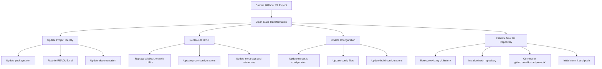

# ProjectX Transformation Plan

**Author:** Tom Cranstoun  
**GitHub:** [@ddttom](https://github.com/ddttom)  
**Target Repository:** https://github.com/ddttom/projectX

## Overview

Complete transformation of AllAbout V2 project to ProjectX with full clean slate approach. This plan covers the systematic removal of all "allabout" references (94+ files identified) and establishment of a new independent project identity.

## Current State Analysis

- **Project Type**: Adobe Edge Delivery Services (EDS) boilerplate project
- **Current Identity**: "AllAbout V2" with extensive references to `allabout.network`
- **Repository Status**: 94+ references to "allabout" across multiple file types
- **Target**: Complete clean slate transformation to "projectX"
- **New Repository**: `https://github.com/ddttom/projectX` (empty, ready for push)

## Transformation Architecture



## Implementation Phases

### Phase 1: Project Identity Transformation

#### 1.1 Core Configuration Updates
- **File**: `package.json`
  - Change name from `@adobe/aem-boilerplate` to `projectX`
  - Update repository URL to `https://github.com/ddttom/projectX`
  - Update author to "Tom Cranstoun"
  - Update homepage and bugs URLs
  - Maintain version as `1.3.0` or reset to `1.0.0`

#### 1.2 Main Documentation Rewrite
- **File**: `README.md`
  - Replace "AllAbout V2 Project" with "ProjectX"
  - Update all development server references
  - Remove allabout.network specific content
  - Update proxy configuration documentation
  - Maintain EDS development guidelines

#### 1.3 Changelog Reset
- **File**: `CHANGELOG.md`
  - Create fresh changelog starting with v1.0.0
  - Remove old commit references
  - Document initial projectX release

### Phase 2: URL and Reference Replacement

#### 2.1 Server Configuration
- **File**: `server.js`
  - Update `PROXY_HOST` from `https://allabout.network`
  - Replace with appropriate development proxy target
  - Update console logging messages

#### 2.2 Runtime Configuration
- **File**: `config/config.js`
  - Update `window.finalHost` reference
  - Replace allabout.network URLs

#### 2.3 Sitemap Configuration
- **File**: `helix-sitemap.yaml`
  - Update origin URL from allabout.network
  - Configure for new domain structure

### Phase 3: Documentation and Content Updates

#### 3.1 AI and Development Documentation
- **Files**: `CLAUDE.md`, `llms.txt`
  - Remove AllAboutV2 references
  - Update attribution and source URLs
  - Maintain EDS development context

#### 3.2 HTML Template Updates
- **Files**: `faq.html`, `AEM.html`, `bio.html`
  - Update meta tags and canonical URLs
  - Replace image references
  - Update Open Graph and Twitter card URLs

#### 3.3 Development Rules and Configuration
- **File**: `.cursorrules`
  - Update image URL references
  - Replace sample image URLs
  - Maintain development standards

### Phase 4: Block and Component Updates

#### 4.1 Block Documentation
- **Directory**: `blocks/`
  - Update README files in all block subdirectories
  - Replace example URLs and references
  - Update DAM block demo content
  - Maintain functional examples with new URLs

#### 4.2 Build Configuration
- **Directory**: `build/spectrum-card/`
  - Update test files and configurations
  - Replace image URLs in examples
  - Update blog.md references

#### 4.3 Documentation Directory
- **Directory**: `docs/`
  - Update all markdown files
  - Replace URL references in guides
  - Update server documentation
  - Maintain EDS development standards

### Phase 5: Git Repository Initialization

#### 5.1 Clean Git History
```bash
# Remove existing git history if present
rm -rf .git

# Initialize fresh repository
git init

# Configure git user
git config user.name "Tom Cranstoun"
git config user.email "your-email@example.com"
```

#### 5.2 Repository Connection
```bash
# Add remote origin
git remote add origin https://github.com/ddttom/projectX.git

# Create initial commit
git add .
git commit -m "Initial commit: ProjectX transformation from AllAbout V2"

# Push to GitHub
git branch -M main
git push -u origin main
```

## Critical Files Requiring Updates

### Configuration Files (Priority 1)
- `package.json` - Project identity and repository
- `README.md` - Main project documentation
- `server.js` - Development server configuration
- `config/config.js` - Runtime configuration
- `helix-sitemap.yaml` - Sitemap configuration

### Documentation Files (Priority 2)
- `CLAUDE.md` - AI development context
- `llms.txt` - AI training documentation
- All files in `docs/` directory
- Block README files throughout `blocks/`

### HTML and Template Files (Priority 3)
- `faq.html` - FAQ page with meta tags
- `AEM.html` - Development server documentation
- `bio.html` - Biography page with images
- Test files in `build/` directory

### Development Configuration (Priority 4)
- `.cursorrules` - Development rules and image URLs
- Various configuration files in `config/`
- Build and test configurations

## URL Replacement Strategy

### From (AllAbout V2):
- `https://allabout.network`
- `https://main--allaboutv2--ddttom.hlx.page`
- `https://main--allaboutv2--ddttom.hlx.live`

### To (ProjectX):
- Development: `http://localhost:3000`
- Production: TBD (to be configured post-deployment)
- GitHub Pages: `https://ddttom.github.io/projectX` (if applicable)

## Validation Checklist

### Post-Transformation Verification
- [ ] No remaining "allabout" references in codebase
- [ ] All URLs updated to projectX context
- [ ] Development server starts successfully
- [ ] All blocks and components function independently
- [ ] Documentation reflects projectX identity
- [ ] Git repository connected to correct remote
- [ ] Initial commit pushed successfully

### Functional Testing
- [ ] `npm run debug` starts development server
- [ ] Local file serving works correctly
- [ ] Proxy fallback functions (if configured)
- [ ] All blocks render properly
- [ ] CSS and JavaScript load correctly
- [ ] No console errors related to missing resources

## Expected Outcomes

1. **Complete Independence**: No remaining ties to AllAbout V2 project
2. **Fresh Git History**: Clean repository with projectX identity
3. **Functional EDS Project**: All Adobe Edge Delivery Services functionality preserved
4. **Updated Development Environment**: Proper proxy settings and local development
5. **Clean Documentation**: All references updated to reflect projectX

## Development Requirements Maintained

- Modern JavaScript (ES modules) without TypeScript
- Pure CSS without preprocessors
- No build-heavy frameworks
- Focus on simplicity and performance
- Clear code organization and documentation
- Minimal dependencies and build steps

## Next Steps

1. Execute transformation plan using Code mode
2. Initialize git repository and connect to GitHub
3. Test all functionality post-transformation
4. Configure production deployment settings
5. Update any remaining environment-specific configurations

---

This transformation will create a completely independent projectX that maintains all EDS functionality while establishing a new project identity free from AllAbout V2 references.