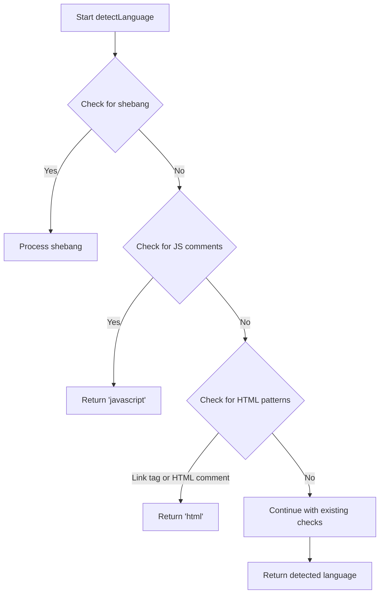

# Implementation Plan: Enhanced HTML Detection

## Overview

This document outlines the plan for enhancing the code-expander block to detect HTML code when a line starts with "<!--" (HTML comment). This improvement will ensure better syntax highlighting and language detection for HTML code snippets.

## Current Functionality

The code-expander block already detects HTML through:
- HTML link tags (lines starting with `<link`)

However, it doesn't detect HTML when a line starts with "<!--", which is a common HTML comment syntax.

## Implementation Details

### Location of Change

- **File**: `blocks/code-expander/code-expander.js`
- **Function**: `detectLanguage(code)`
- **Placement**: In the HTML detection section (around line 88)

### Code Change

```javascript
// Check for HTML link tag or HTML comments
if (firstLine.trim().startsWith('<link') || firstLine.trim().startsWith('<!--')) {
  return 'html';
}
```

### Implementation Steps

1. Modify the existing HTML detection condition to also check for lines starting with "<!--"
2. Ensure proper indentation and code style
3. Test the change with various code snippets
4. Verify that other language detection still works correctly

## Flow Diagram



## Testing Approach

1. Test with code snippets that start with "<!--" comments
2. Verify that they are correctly identified as HTML
3. Ensure that other language detection still works correctly
4. Test edge cases like mixed language patterns

## Benefits

- Improved language detection for HTML code snippets
- Better syntax highlighting for HTML code
- Enhanced user experience when viewing code with HTML comments
- More comprehensive language detection system

## Next Steps After Implementation

1. Consider adding detection for other common HTML patterns (e.g., DOCTYPE declarations)
2. Evaluate if similar detection improvements could benefit other languages
3. Document the changes in the code-expander block's documentation