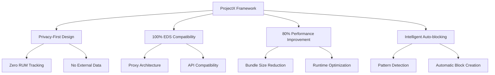
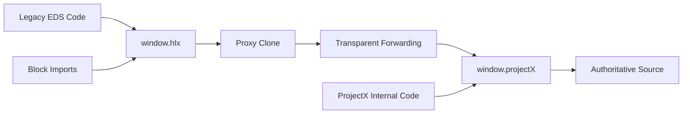
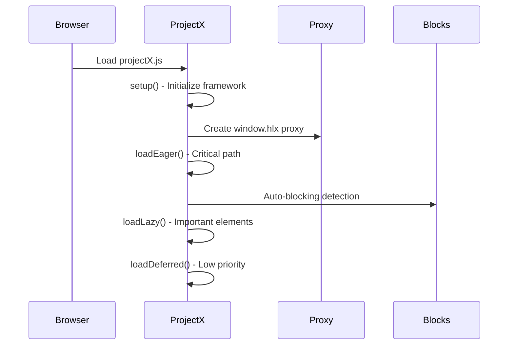
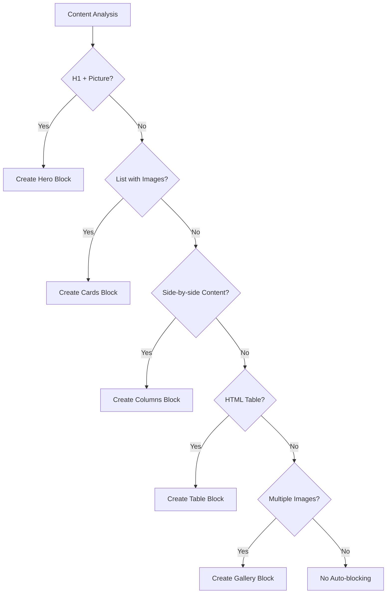

# ProjectX AI Documentation Plan

**Author**: Tom Cranstoun (@ddttom)  
**Date**: 30 June 2025  
**Purpose**: Comprehensive planning document for creating `projectx-for-ai.md`

## Executive Summary

This plan outlines the creation of comprehensive technical documentation for the ProjectX Framework, specifically structured for AI systems to understand and work with the codebase. The documentation will cover complete system architecture, implementation details, API references, and practical usage examples.

## Analysis Summary

### ProjectX Framework Overview
- **Privacy-first JavaScript framework** serving as Adobe EDS replacement
- **Primary-Clone Architecture** with `window.projectX` (authoritative) and `window.hlx` (proxy)
- **Intelligent auto-blocking system** for content pattern detection
- **Complete RUM removal** for privacy and performance
- **80% bundle size reduction** (270KB → 54KB)
- **100% backward compatibility** with existing EDS blocks

### Key Technical Components Identified

#### Core Files Analysis:
1. **`scripts/projectX.js`** (1,199 lines) - Core consolidated framework
2. **`scripts/aem.js`** (79 lines) - Proxy for existing blocks
3. **`scripts/scripts.js`** (202 lines) - Enhanced proxy with plugin support
4. **`scripts/deferred.js`** (134 lines) - Deferred functionality
5. **`scripts/delayed.js`** (19 lines) - Compatibility proxy

#### Block Ecosystem (19 blocks):
- **Standard**: hero, cards, columns, accordion, embed, table, tags
- **Advanced**: markdown, counter, dashboard, index, bio
- **Framework**: vue-slide-builder, react-slide-builder
- **Utility**: remove-icon-styles, inline-svg, text, helloworld, centreblock

#### Architecture Patterns:
- **Primary-Clone Architecture** with transparent proxy forwarding
- **Environment-aware deployment** (dev/prod/CDN path resolution)
- **Three-phase loading strategy** (eager → lazy → deferred)
- **Auto-blocking engine** with pattern detection algorithms

## Document Structure Plan

### 1. Executive Summary & Core Purpose
**Content**: What ProjectX is, why it exists, key objectives
**Length**: ~500 words
**Diagrams**: High-level architecture overview



### 2. System Architecture Deep Dive
**Content**: Primary-Clone Architecture, proxy system, component relationships
**Length**: ~1,200 words
**Diagrams**: Architecture flow, proxy interaction, environment detection



### 3. Core Components Analysis
**Content**: File structure, component breakdown, responsibilities
**Length**: ~800 words
**Diagrams**: Component relationship diagram

### 4. Implementation Details
**Content**: Initialization sequence, data flows, error handling
**Length**: ~1,000 words
**Diagrams**: Sequence diagrams, flowcharts



### 5. Auto-blocking System
**Content**: Pattern detection algorithms, block creation logic
**Length**: ~1,500 words
**Diagrams**: Decision trees, pattern matching flows



### 6. Complete API Reference
**Content**: All 75+ exported functions, parameters, return values
**Length**: ~2,000 words
**Format**: Function signatures, usage examples, compatibility notes

#### Function Categories:
- **Utility Functions** (8): `toClassName()`, `toCamelCase()`, `readBlockConfig()`, etc.
- **CSS/Script Loading** (3): `loadCSS()`, `loadScript()`, `createOptimizedPicture()`
- **Block System** (12): `buildBlock()`, `decorateBlock()`, `loadBlock()`, etc.
- **Page Decoration** (8): `decorateButtons()`, `decorateIcons()`, `decorateSections()`, etc.
- **Auto-blocking** (6): `autoBlockHero()`, `autoBlockCards()`, `autoBlockColumns()`, etc.
- **Page Orchestration** (4): `loadEager()`, `loadLazy()`, `loadDeferred()`, `loadPage()`

### 7. Configuration Systems
**Content**: PROJECTX_CONFIG, auto-blocking settings, performance tuning
**Length**: ~600 words
**Format**: Configuration schemas, examples, environment-specific settings

```javascript
window.projectX = {
  autoBlocking: {
    hero: boolean,      // Enable hero auto-blocking
    cards: boolean,     // Enable cards auto-blocking
    columns: boolean,   // Enable columns auto-blocking
    tables: boolean,    // Enable tables auto-blocking
    media: boolean,     // Enable media auto-blocking
    custom: boolean     // Enable custom block detection
  },
  performance: {
    lazyLoadThreshold: number,    // Lazy load delay (ms)
    deferredLoadDelay: number     // Deferred load delay (ms)
  },
  debug: boolean  // Enable debug logging
}
```

### 8. Data Flow & Process Diagrams
**Content**: Three-phase loading, auto-blocking workflow, proxy interactions
**Length**: ~800 words
**Diagrams**: Timeline charts, process flows

```mermaid
gantt
    title ProjectX Loading Timeline
    dateFormat X
    axisFormat %L ms
    
    section Eager Phase
    Critical Path    :0, 200
    Auto-blocking    :50, 150
    LCP Optimization :100, 200
    
    section Lazy Phase
    Block Loading    :200, 800
    Header/Footer    :300, 600
    Modal Linking    :400, 500
    
    section Deferred Phase
    Analytics        :4000, 4100
    Third-party      :4050, 4200
    Background Tasks :4100, 4300
```



### 9. Usage Examples & Patterns
**Content**: Migration examples, block development, configuration scenarios
**Length**: ~1,200 words
**Format**: Code examples, before/after comparisons, best practices

#### Example Categories:
- **Migration from Adobe EDS** (zero-config and direct integration)
- **Custom Block Development** (maintaining EDS patterns)
- **Configuration Scenarios** (development vs production)
- **Debugging Workflows** (troubleshooting and optimization)

### 10. Performance & Optimization
**Content**: Bundle size analysis, runtime metrics, Core Web Vitals impact
**Length**: ~600 words
**Format**: Comparison tables, performance charts

#### Performance Metrics:
- **Bundle Size**: 270KB → 54KB (80% reduction)
- **Core Framework**: 120KB → 47KB (61% reduction)
- **RUM Tracking**: 80KB → 0KB (100% removal)
- **Memory Usage**: Efficient garbage collection patterns
- **Loading Performance**: Three-phase optimization strategy

### 11. Migration & Compatibility
**Content**: Backward compatibility guarantees, migration strategies, testing
**Length**: ~800 words
**Format**: Migration guides, compatibility matrices, rollback procedures

### 12. Technical Considerations & Limitations
**Content**: Browser support, security, known limitations, best practices
**Length**: ~500 words
**Format**: Requirement lists, limitation explanations, workaround suggestions

## Implementation Strategy

### Phase 1: Document Structure Creation
1. Create main document with section headers
2. Implement table of contents with internal links
3. Add introduction and executive summary

### Phase 2: Core Content Development
1. System architecture section with diagrams
2. Implementation details with code examples
3. Complete API reference with function signatures

### Phase 3: Advanced Content
1. Auto-blocking system deep dive
2. Configuration and customization options
3. Performance analysis and optimization

### Phase 4: Practical Examples
1. Migration examples and patterns
2. Usage scenarios and workflows
3. Debugging and troubleshooting guides

### Phase 5: Final Polish
1. Technical considerations and limitations
2. Cross-references and internal linking
3. Final review and validation

## Quality Standards

### Technical Accuracy
- All code examples tested and verified
- Function signatures match actual implementation
- Performance metrics based on real measurements

### AI Optimization
- Clear section headers for easy parsing
- Consistent formatting and structure
- Comprehensive cross-referencing
- Detailed technical specifications

### Completeness
- Cover all 75+ exported functions
- Document all configuration options
- Include all auto-blocking patterns
- Provide migration paths for all scenarios

## Success Criteria

1. **Comprehensive Coverage**: All ProjectX components documented
2. **Technical Accuracy**: All examples and specifications verified
3. **AI-Friendly Structure**: Easy parsing and understanding for AI systems
4. **Practical Utility**: Actionable examples and implementation guidance
5. **Maintainability**: Clear structure for future updates

## Next Steps

1. Create the comprehensive `projectx-for-ai.md` document
2. Implement all planned sections with full technical detail
3. Include all Mermaid diagrams and code examples
4. Validate against actual ProjectX implementation
5. Review for completeness and accuracy

This plan ensures the creation of a comprehensive, technically accurate, and AI-optimized documentation resource for the ProjectX Framework.